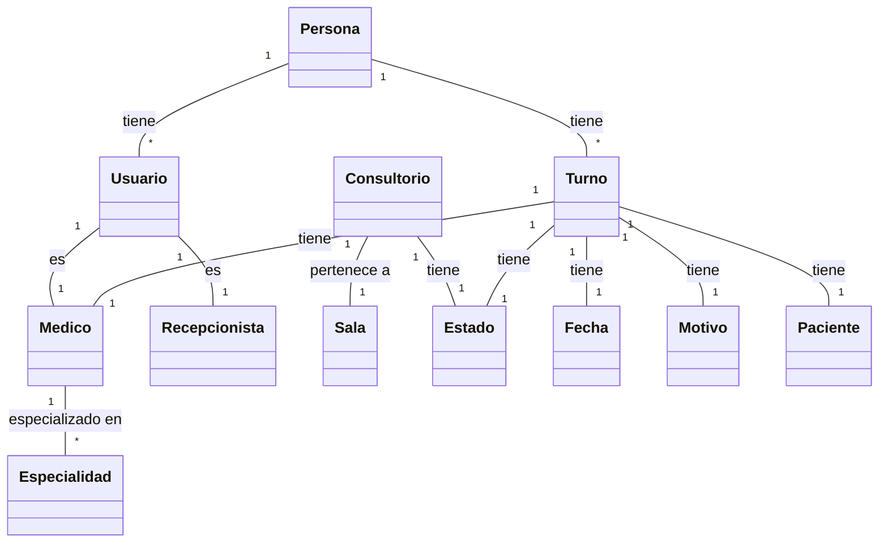

```mermaid
classDiagram

Persona "1" -- "*" Usuario: tiene
Usuario "1" -- "1" Medico: es
Usuario "1" -- "1" Recepcionista: es
Medico "1" -- "*" Especialidad: especializado en
Consultorio "1" -- "1" Sala: pertenece a
Consultorio "1" -- "1" Estado: tiene
Turno "1" -- "1" Fecha: tiene
Turno "1" -- "1" Estado: tiene
Turno "1" -- "1" Motivo: tiene
Turno "1" -- "1" Medico: tiene
Turno "1" -- "1" Paciente: tiene
Persona "1" -- "*" Turno: tiene

```
