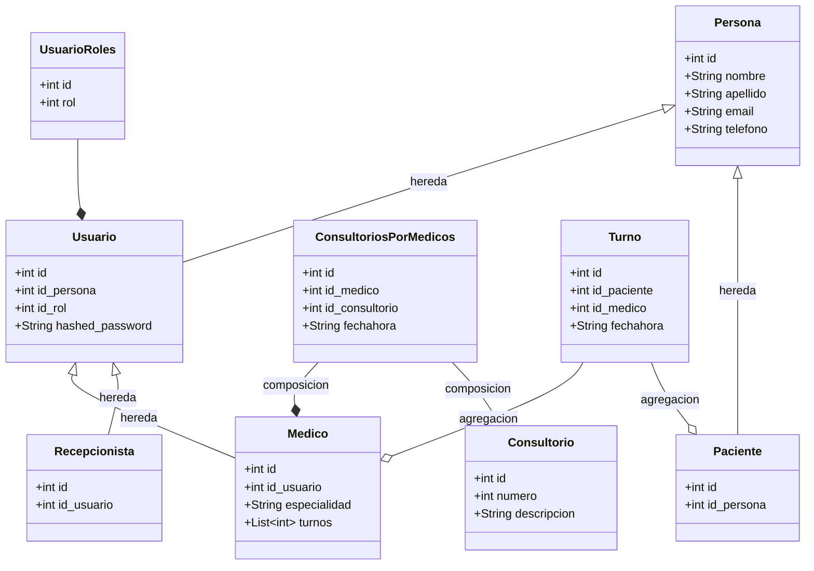

```mermaid
classDiagram    
    
    class Persona{
        +int id
        +String nombre
        +String apellido
        +String email
        +String telefono

    }
    
    class Paciente{
        +int id
        +int id_persona
    }

    class UsuarioRoles{
        +int id
        +int rol
    }
    
    class Usuario{
      +int id
      +int id_persona
      +int id_rol
      +String hashed_password
    }
    
    class Medico{
        +int id
        +int id_usuario
        +String especialidad
        +List~int~ turnos
    }

    class Recepcionista{
        +int id
        +int id_usuario
    }

    class Consultorio{
        +int id
        +int numero
        +String descripcion
    }

    class ConsultoriosPorMedicos{
        +int id
        +int id_medico
        +int id_consultorio
        +String fechahora
    }
    
    class Turno{
        +int id
        +int id_paciente
        +int id_medico
        +String fechahora
    }
    
    Persona <|-- Paciente : hereda
    Persona <|-- Usuario : hereda
    Usuario <|-- Recepcionista : hereda    
    Usuario <|-- Medico : hereda
    ConsultoriosPorMedicos --* Consultorio : composicion
    ConsultoriosPorMedicos --* Medico : composicion
    Turno --o Paciente : agregacion
    Turno --o Medico : agregacion
    
    UsuarioRoles --* Usuario
```
